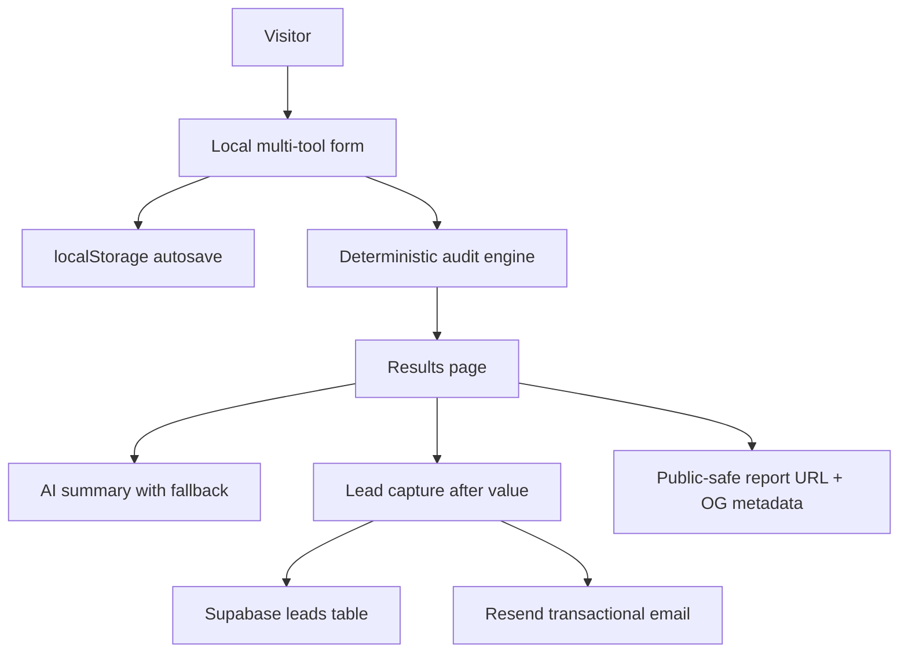

# Architecture

## Data flow
The user enters team size, use case, tools, plans, seats, and spend. The audit engine normalizes spend, evaluates plan-rightsizing, duplicate-tool consolidation, API optimization, benchmark variance, and discounted-credit opportunities. Private lead fields are submitted only after results are visible.

## Scaling to 10k audits/day
Use CDN-cached public report pages, durable audit result storage, Redis/Upstash rate limiting, background email queues, structured logs, and cached pricing snapshots with a weekly verification process.
